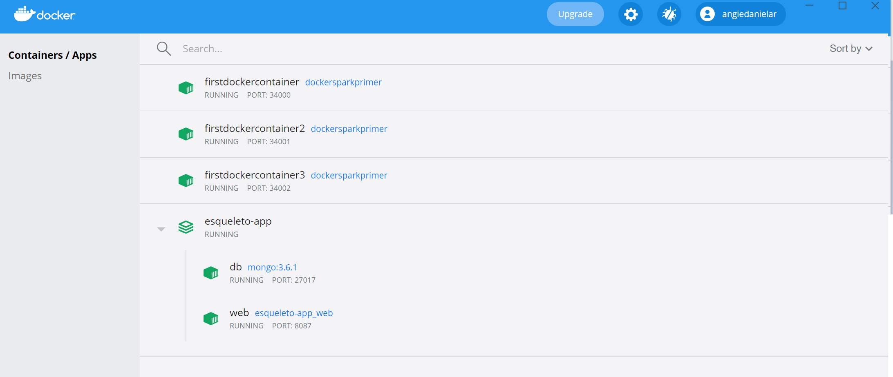
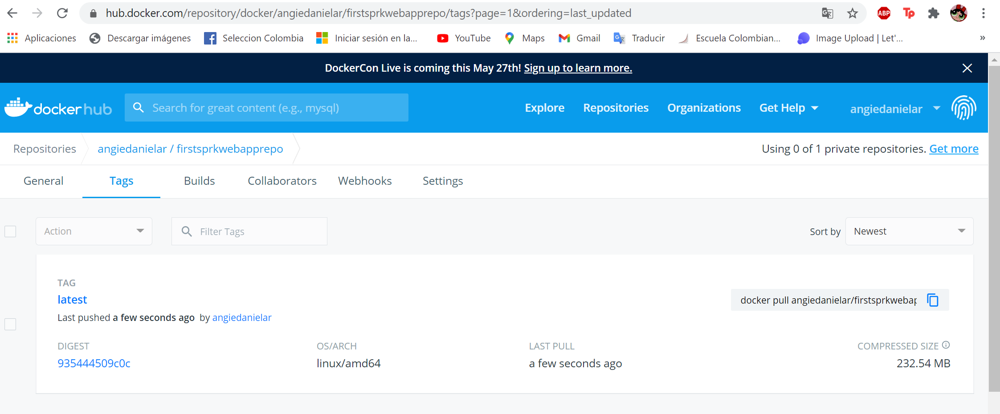
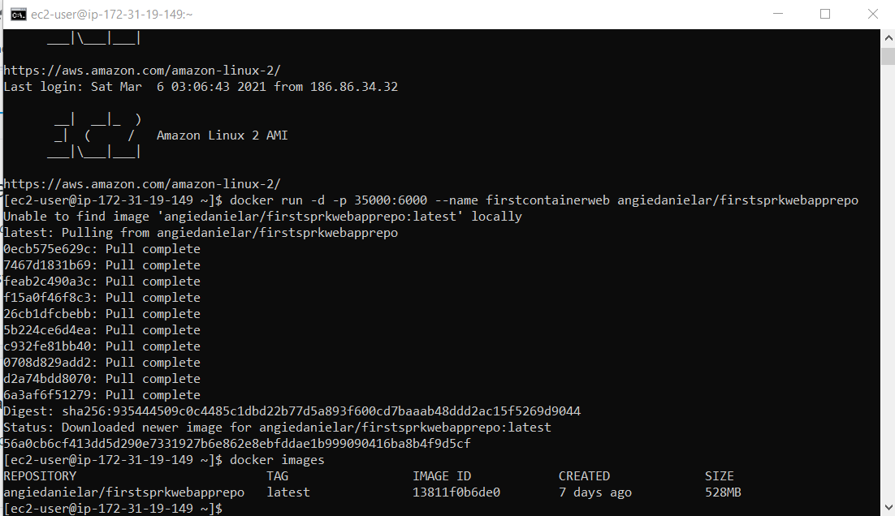

# LABORATORY - MODULARIZATION WORKSHOP WITH VIRTUALIZATION AND INTRODUCTION TO DOCKER AND AWS. 🚀

## Escuela Colombiana de Ingeniería - Enterprise Architectures(AREP).

_In this lab create a small web application using the Spark java micro-framework, also create a container for docker (to be used with the aforementioned application), where you deploy and configure both locally. Then in a repository that I created in DockerHub I uploaded the image so that finally in a virtual machine that I created in AWS (where we previously installed Docker) I could deploy my container._

## Getting Started

### Prerequisites

- [Maven](https://maven.apache.org/) - Dependency Management.

- [Java 8](https://www.oracle.com/co/java/technologies/javase/javase-jdk8-downloads.html) -  Development Environment.

- [Git](https://git-scm.com/) - Version Control System.

- [Spark](http://sparkjava.com/) - Micro framework for creating web applications in Java 8.


Make sure you have this programs installed correctly and the version that we need with the following commands:

```
mvn --version
```

```
git --version
```

```
java -showversion
```

### Installing

1. Clone the repository:

```
git clone https://github.com/angiedanielar/LAB5_AREP.git
```

2. Compile the projet:

```
mvn package
```

3. Executing the program:

```
docker-compose up
```


4. Generating the documentation:

```
mvn javadoc:javadoc
```

## Results

_The results obtained during the process._










## Built With

- [Maven](https://maven.apache.org/) - Dependency Management

- [Java 8](https://www.oracle.com/co/java/technologies/javase/javase-jdk8-downloads.html) -  Development Environment.

- [Git](https://git-scm.com/) - Version Control System.

- [Spark](http://sparkjava.com/) - Micro framework for creating web applications in Java 8.

- [CircleCI](https://circleci.com/) [](https://app.circleci.com/pipelines/github/angiedanielar/LAB5_AREP) - Continuous Integration.

- [Latex](overleaf.com) - Text composition system.

- [Heroku](https://www.heroku.com/platform) - Deploy platform.

## Author

- Angie Daniela Ruiz Alfonso.

## License

This project is under GNU General Public License - see the [LICENSE](LICENSE) file for details.
